# Interaction Design

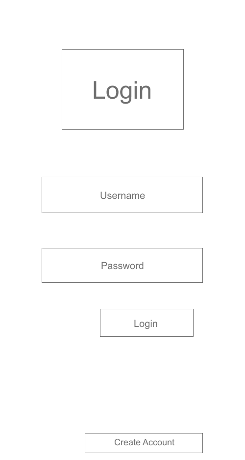

The login page is what our user will first see. We wanted to keep it familiar to the user while being as basic as possible to provide the user with a quick and simple way into the app.

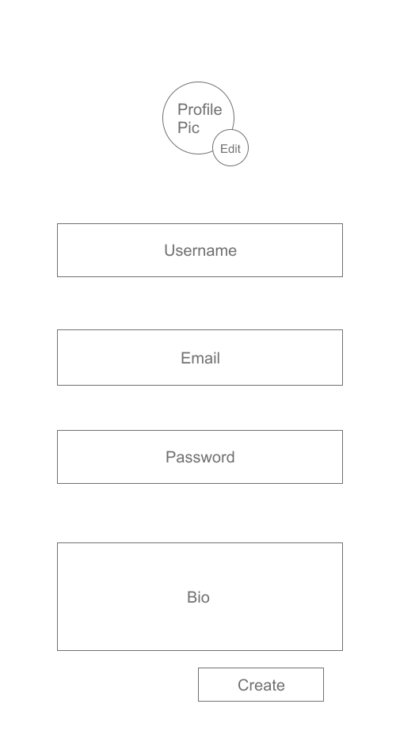

When a user goes to register an account, they are greeted again with a familiar/simple screen.

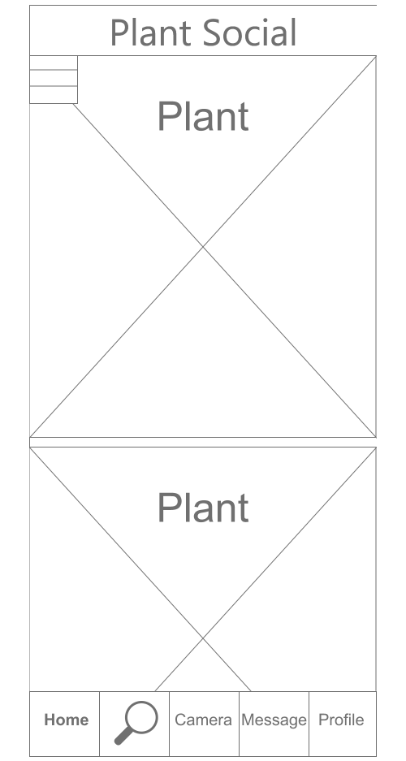

This is the home page that a user will see upon opening the app. They can scroll through plant posts, choose where they want to go via the bottom task bar, and bring out the side menu via the top left. The decision for the bottom task bar is heavily based on our scenarios of users wanting to get information of plants without wasting a lot of time, so having the app's functionalities at the bottom for ease of access helps with the scenario in mind.

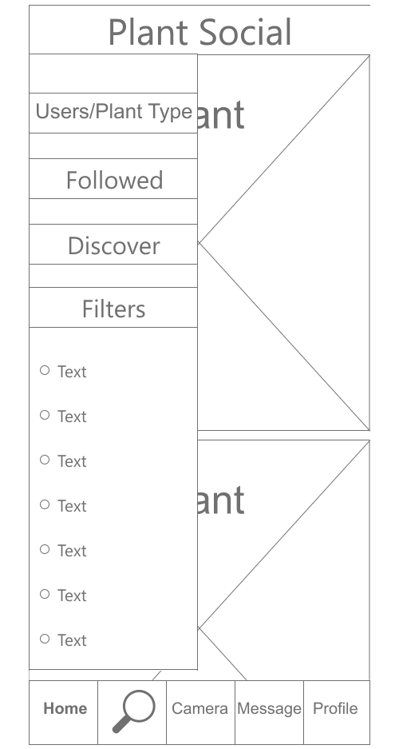

With the sidebar menu, a user can modify what type of plant posts they will see through the provided options. Since a main goal of the app is plant preservation, a user can view the posts with more information via the User/Plant Type option. This allows the user to know who posted it, see the identifcation of the plant, and message the appropriate user. The Followed, Discover, and Filters options are bit more self explanatory, where they allow more modifcation on what kind of posts the user can see on the home page. 

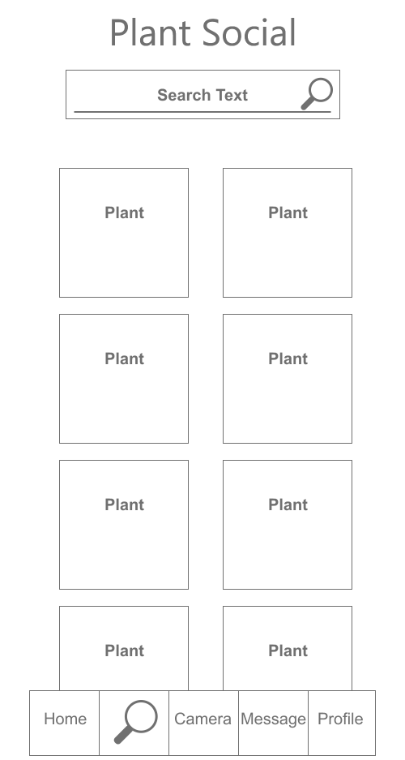

When a user clicks on the search, they are provided with a grid of suggested plants and a search bar at the top. The grid of plants might have the plant the user is searching for, and could the user time by cutting out the manual search. If a user performs a manual search, they can find the plant they searched for along with the plant's owner.

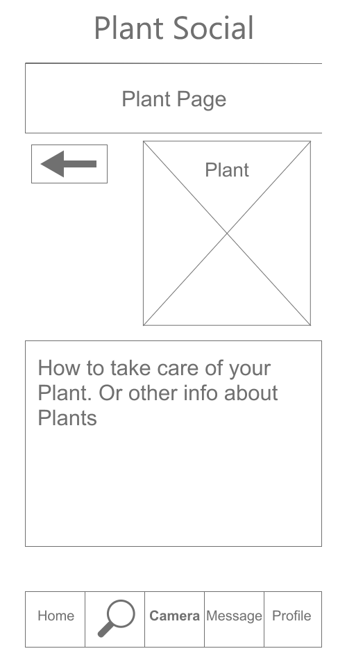

A user will see a variation of this page whenever they interact with a plant post, whether it be via search, homepage, or a profile. Since our feedback indicated the user's need for plant information, this is where we wanted to **focus where they can get their information, and have it accessible via multiple means**. 

  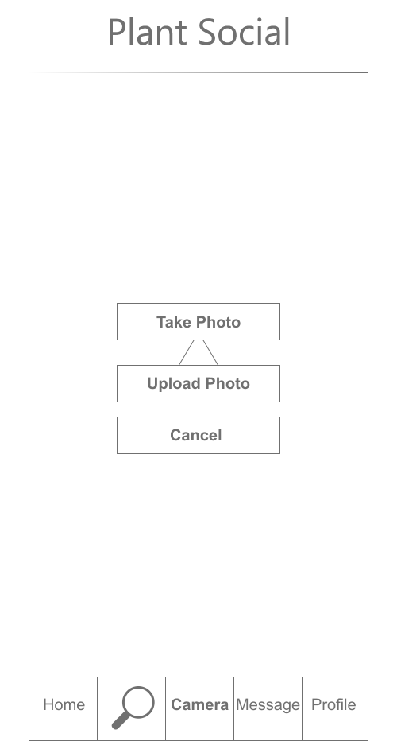
  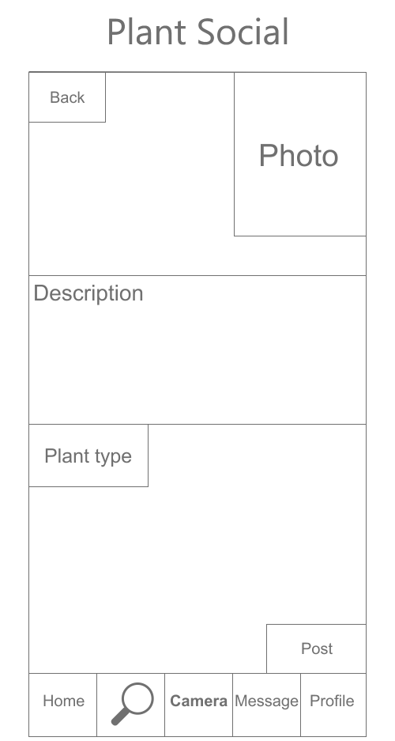 

A user can go to the camera page (left image) and have the option of taking a photo right now or choosing from a photo from their gallery. From there, they can go on to upload the plant as a post for their profile since **user feedback indicated a strong need for plant portfolio creation**. The upload page (right image) has familiar aspects of post creation, with the photo, description, and plant type. 

  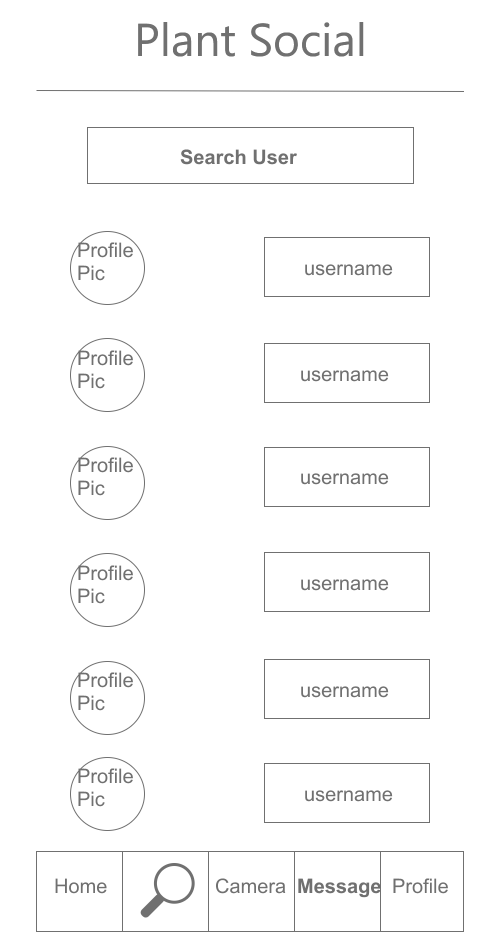
  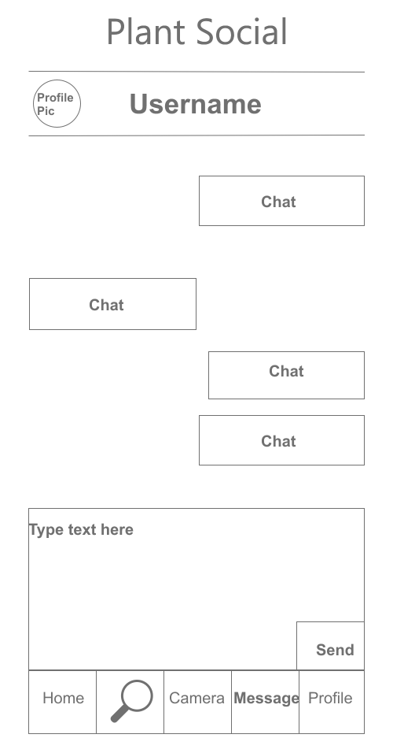 

A user can view their messages with other users since we wanted to **focus on the social media aspect for the application.** From here, they can chat with another user.

  
  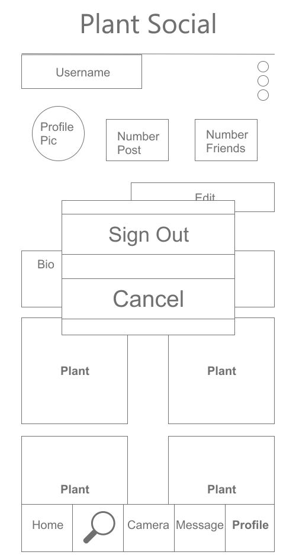

We designed the profile page to be similar to how other social medias present their profiles. We gave basic functions like clicking the three dots at the top to sign out, edit your profile from this page, and view all your posts. We wanted all the basic functionalities one would expect from a profile page, but we wanted the focus here to be that this is the "portfolio" of plants that user feedback expressed the need of.

  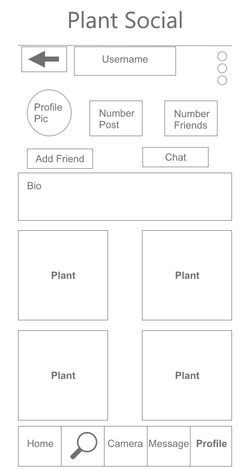
  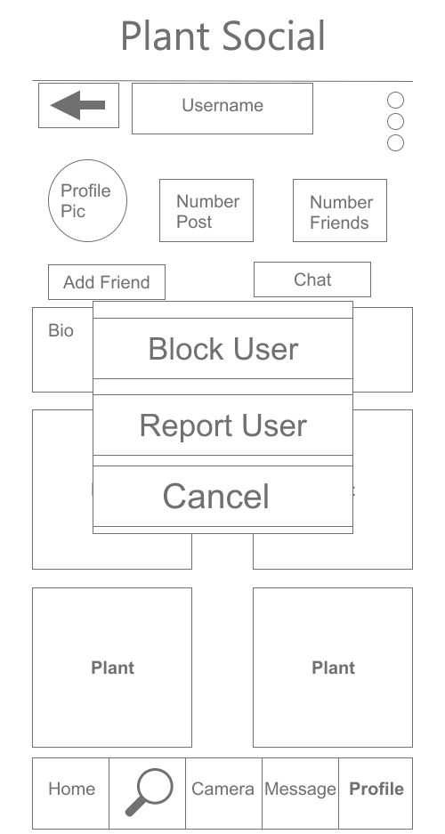 
  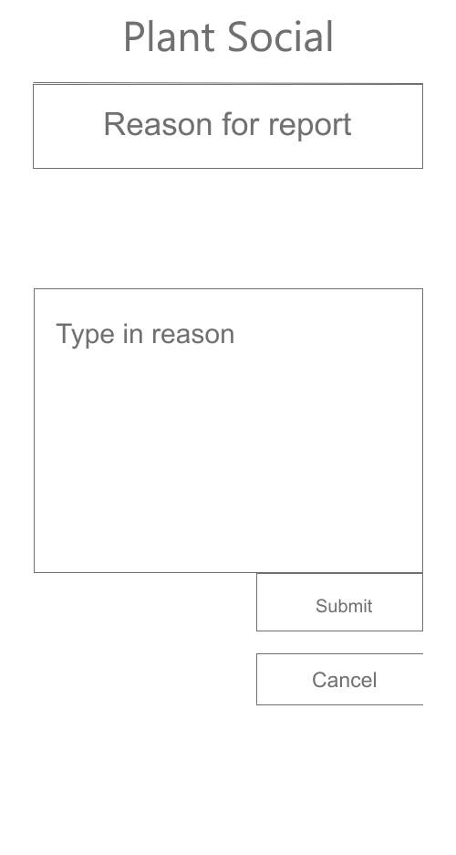 

Another user's profile page will be similar to the user's own profile page, but with the obvious differences of adding, chatting, and option to block/report. Since a user might spend a lot of time looking through other user's profile, we wanted to ensure that the expected functionalities are here.

## Supplementary Materials
[Wireframes](Wireframe.pdf)

[Prototype](https://xd.adobe.com/view/b8d4d931-97b2-4812-8e51-e18f12291b86-ed87/?fullscreen&hints=off)
